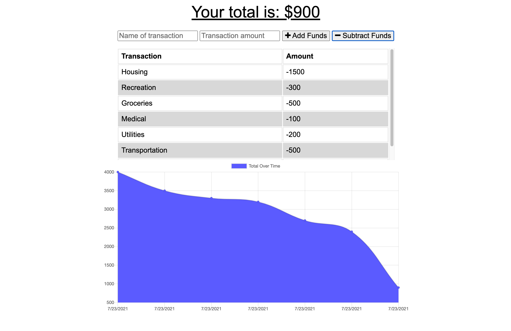

# progressive-budget

## Description
A budget tracker application that allows for offline access and functionality.

Here's the deployed application: [https://damp-sands-25430.herokuapp.com/](https://damp-sands-25430.herokuapp.com/)

The following images show the application’s appearance.



## Installation

To install necessary dependencies, run the following command:

```md
npm i
```

## Usage

To start the application run the following command.

```md
npm start
```